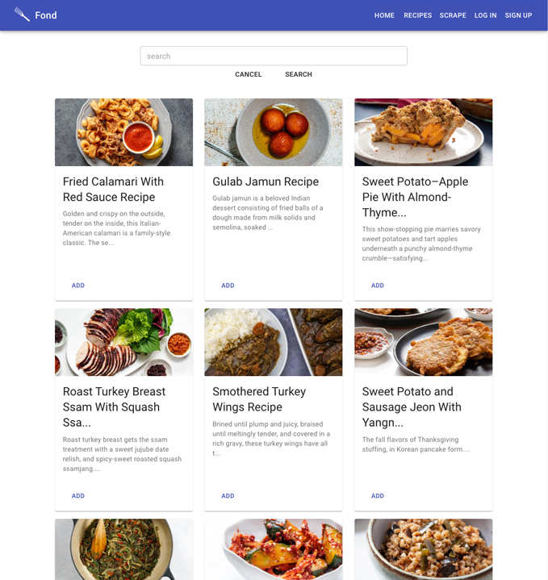
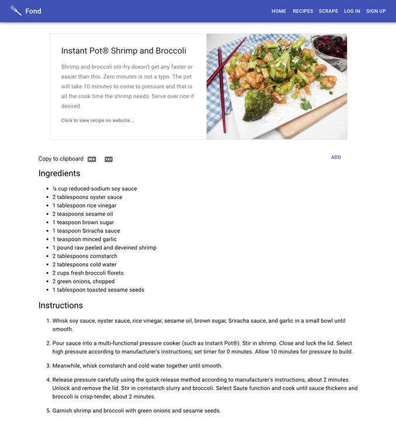
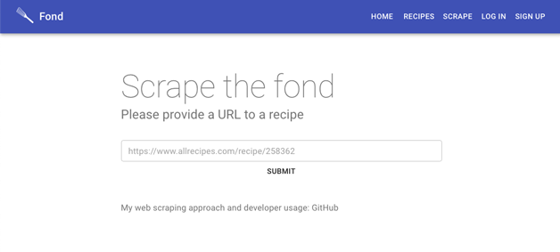

# Fond

>The culinary term fond, French for "base" or "foundation", refers to this sauce, although it is also sometimes used to describe the browned food bits instead (commonly in the United States). - [Wikipedia](https://en.wikipedia.org/wiki/Deglazing_(cooking))

---
Fond is a full stack recipe web app and web scraper built using NodeJS, React, PostgreSQL, and Express. It's goal is to make it easier to see recipe instructions and ingredients and to share recipes with oneself. Fond is also implemented for the command line, and is on the `command-line` branch. Web API is hosted on [Heroku](https://fond-backend.herokuapp.com/) Front End Repository: [GitHub](https://github.com/brian-trann/fond-frontend).


## The problem I am trying to solve:
 I am trying to solve the inconvenient problem of needing to parse through a lengthy recipe website with modals blocking the ability to scroll. I especially find this inconvenient when I am at the grocery store and I need to make sure I have all of the ingredients, only to have to parse through the web page again because it reloaded on my phone… Only to have the recipe reload again when I go to cook it. I want an easy way to see the recipe instructions and ingredients without needing to repeatedly deal with these issues. 

Another slight quirk, with popular recipe websites is that there sometimes is a lengthy story behind how they came up with the recipe itself.

I just want a way to easily see the recipe, ingredients and instructions... The "fond" of the recipe page.

While this iteration does not solve my problem, I think that it will be a backbone for a future front end tool, or an extension that has the capability to send yourself the raw recipe text via email or to integrate a productivity tool like Trello or Asana.


## Approach
The API uses `Fond.scrapeFond(url)` which scrapes recipe data by targeting the `@Recipe` inside of ld+json scripts. It takes advantage of [Google's structured data guidelines for recipes](https://developers.google.com/search/docs/data-types/recipe). This iteration used [Bon Appetit](https://www.bonappetit.com/) and [Serious Eats](https://www.seriouseats.com/) as a target. **Update 5/5/2021:** Serious Eats rolled out a new website design that breaks the scraper.

## Considerations
The way that I implemented the scraping functionality is extremly specific, and it might not work for all recipe websites. This implementation takes advantage of the fact that recipe websites want to be seen on Google's search engine, and if websites are not using it, this will not work.

Another consideration is that the `@Recipe` spec might change.

## Preview
### Recipes Page


### Recipe Page


### Scraping Page


## To Do's:
- [ ] Implement Email Authorization / Confirmation
  - [ ] Confirm Email
  - [ ] Resend Email Verification (token)

# Usage

### Endpoints:
* GET `/recipe` - Returns an array of recipes. Default limit: 20
  * { recipes : [ { id, url, raw_recipe, keywords, title } ] }
* GET `/recipe/id` - Returns { recipe }
* POST `/recipe/scrape` - URL needs to be in Request Body. Returns a recipe object || error
  * { url } => { response: {recipe : {} , success: BOOL }}
  * { url } => { response: {error : String , success: BOOL }}

### Example:
* URL used in example: [Serious Eats Recipe Link](https://www.seriouseats.com/recipes/2013/11/sous-vide-deep-fried-turkey-porchetta-recipe.html)

#### POST `/recipe/scrape` endpoint: 
```json
{
  "recipe": {
    "@context": "http://schema.org/",
    "@type": "Recipe",
    "name": "Deep-Fried Sous Vide Turkey Porchetta (Turchetta) Recipe",
    "datePublished": "2013-11-13T12:35:00",
    "dateModified": "2019-12-05T16:45:15",
    "description": "Combine the precision of sous vide cooking with crispy deep-fried skin for the most show-stopping, satisfying Thanksgiving turkey ever.",
    "image": [
      "https://www.seriouseats.com/recipes/images/2016/11/20161114-sous-vide-turkey-porchetta-video-primary.jpg",
      "https://www.seriouseats.com/recipes/images/2016/11/20161114-sous-vide-turkey-porchetta-video-primary-1500x1125.jpg",
      "https://www.seriouseats.com/recipes/images/2016/11/20161114-sous-vide-turkey-porchetta-video-primary-750x563.jpg",
      "https://www.seriouseats.com/recipes/images/2016/11/20161114-sous-vide-turkey-porchetta-video-primary-300x225.jpg",
      "https://www.seriouseats.com/recipes/images/2016/11/20161114-sous-vide-turkey-porchetta-video-primary-625x469.jpg",
      "https://www.seriouseats.com/recipes/images/2016/11/20161114-sous-vide-turkey-porchetta-video-primary-200x150.jpg"
    ],
    "aggregateRating": {
      "@type": "AggregateRating",
      "ratingValue": "4.7692307692308",
      "ratingCount": "13"
    },
    "recipeCategory": [
      "Sous Vide",
      "Turkey",
      "Mains",
      "Christmas",
      "Deep Frying",
      "Fall",
      "Stovetop",
      "Thanksgiving",
      "Winter"
    ],
    "recipeYield": "Serves 5 to 6",
    "totalTime": "PT11H30M",
    "recipeIngredient": [
      "1 recipe turkey porchetta, prepared through the end of step 7, skipping wrapping and refrigerating step at end of step 5",
      "1 1/2 quarts (1.4L) peanut or canola oil for deep-frying, or 2 tablespoons (30ml) canola oil for pan-frying",
      "Kosher salt"
    ],
    "recipeInstructions": [
      {
        "@type": "HowToStep",
        "text": "After forming and tying turkey porchetta (as described in step 5 of our turkey porchetta recipe), transfer to a sous vide–style vacuum-sealer bag. Seal tightly and let rest for at least 6 hours and up to 2 days."
      },
      {
        "@type": "HowToStep",
        "text": "Preheat sous vide water bath to 140°F (60°C). Add turkey and cook for 4 to 5 hours. Remove and run under cool running water, or transfer to an ice bath to chill for 5 minutes. Remove from bag and add any congealed juices to gravy. Rinse turkey porchetta thoroughly and carefully pat dry with paper towels. Trim ends for a more cylindrical shape, if desired."
      },
      {
        "@type": "HowToStep",
        "text": "To Finish by Deep-Frying: Heat 1 1/2 quarts (1.4L) peanut oil to 400°F (204°C) in a large wok or Dutch oven. Do not fill cooking vessel more than one-third of the way, in order to allow for bubbling and displacement when you add turkey. Carefully slide turkey into oil using spatulas and tongs (it will not be fully submerged). Immediately cover and cook, shaking pan occasionally, until sputtering dies a bit, about 2 minutes. Adjust flame to maintain a consistent 350°F (177°C) temperature. Using a large metal ladle, continuously spoon hot oil over exposed portions of roast until bottom half is cooked and crisp, about 5 minutes. Carefully flip and cook on second side, basting the whole time. Proceed to step 5."
      },
      {
        "@type": "HowToStep",
        "text": "To Finish by Pan-Roasting: While wearing an apron (the turkey can splatter), heat 2 tablespoons (30ml) canola oil in a large stainless steel or cast iron skillet over high heat until gently smoking. Add turkey and cook, turning occasionally, until well browned on all sides, about 10 minutes total."
      },
      {
        "@type": "HowToStep",
        "text": "Remove turchetta to a large paper towel–lined plate and blot all over. Season with salt. Let rest 5 minutes. Carve and serve with gravy on the side."
      }
    ],
    "author": {
      "@type": "Person",
      "name": "J. Kenji López-Alt",
      "jobTitle": "Chief Culinary Advisor",
      "sameAs": [
        "https://www.facebook.com/kenjilopezalt/",
        "https://www.twitter.com/@kenjilopezalt"
      ],
      "description": "J. Kenji López-Alt is a stay-at-home dad who moonlights as the Chief Culinary Consultant of Serious Eats and the Chef/Partner of Wursthall, a German-inspired California beer hall near his home in San Mateo. His first book,  The Food Lab: Better Home Cooking Through Science (based on his Serious Eats column of the same name) is a New York Times best-seller, recipient of a James Beard Award, and was named Cookbook of the Year in 2015 by the International Association of Culinary Professionals. Kenji's next project is a children’s book called Every Night is Pizza Night, to be released in 2020, followed by another big cookbook in 2021.",
      "url": "https://www.seriouseats.com/user/profile/kenjilopezalt"
    },
    "keywords": "deep-fried, holiday, low carb, porchetta, thanksgiving, turchetta, turkey"
  }
}
```

# Future Goals
* App integration for popular productivity apps like Trello, Notion, or Asana via the OAuth Framework
  * I think it would be great to automatically add cards to my kanban board that I use to keep track of recipes I like.

## Other Thoughts
I do not think that this needs to be a recipe manager. I think that people already have their own way that they like to keep track of things. Whether it be in Google Docs, Trello, Asana, Email, or even simply by printing things. I think that this tool can be like "middleware", similar to middleware in the context of Express. It just helps with a executing a task, and hopefully gives you the response (or recipe) that you are looking for.

## Node Version
v12.18.3